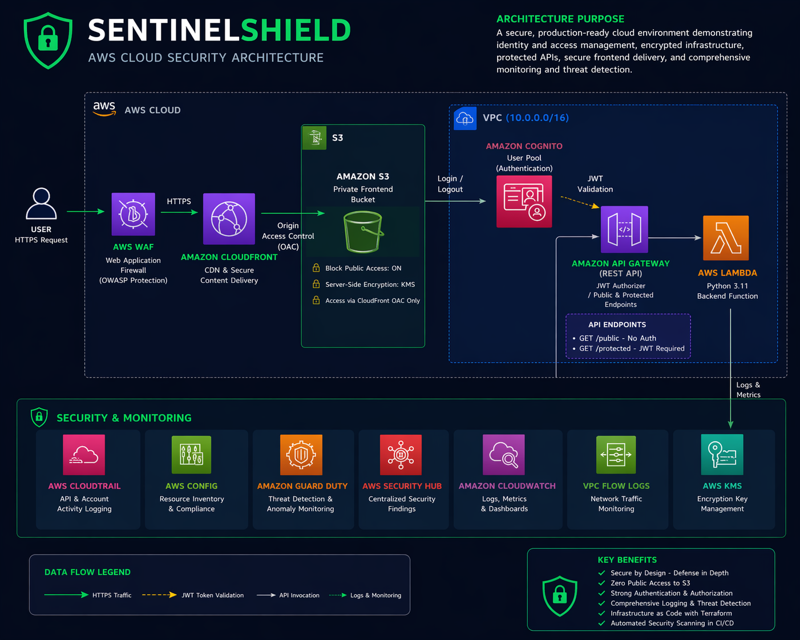
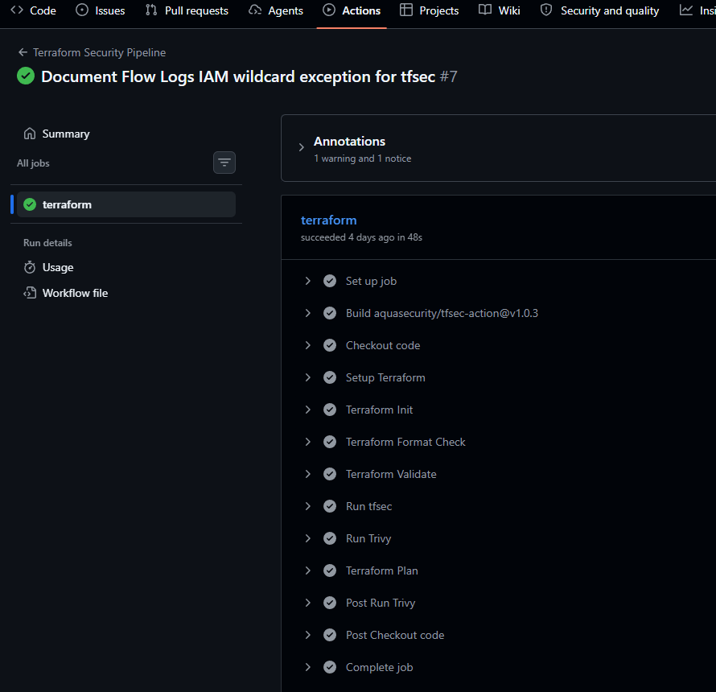
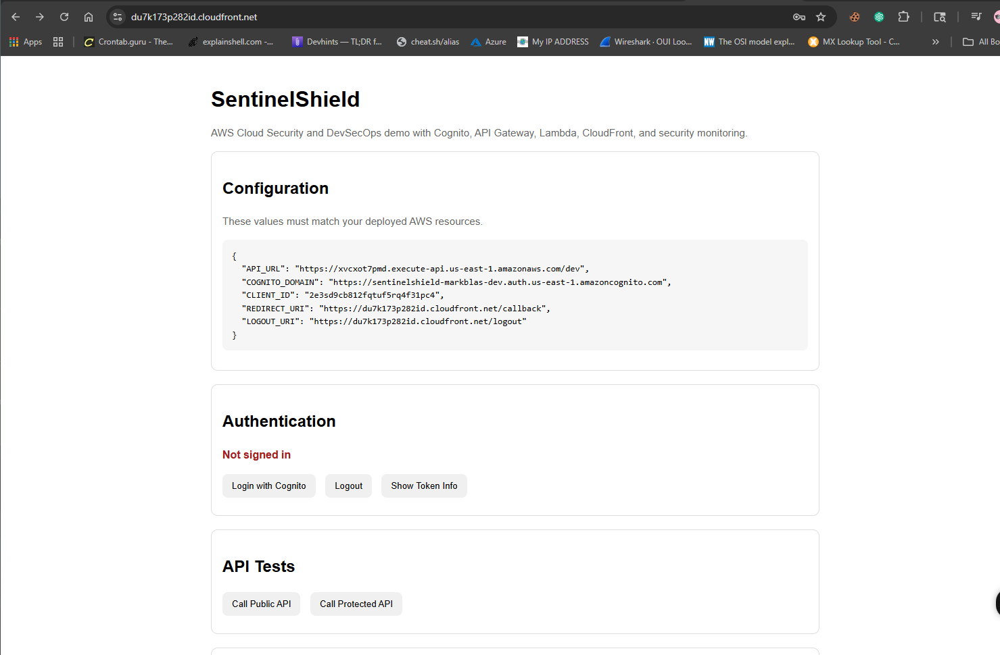
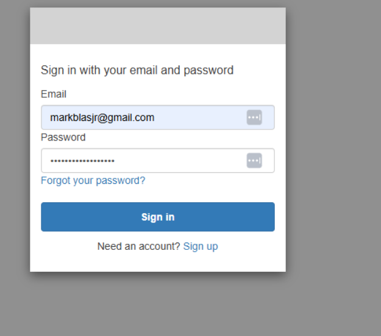
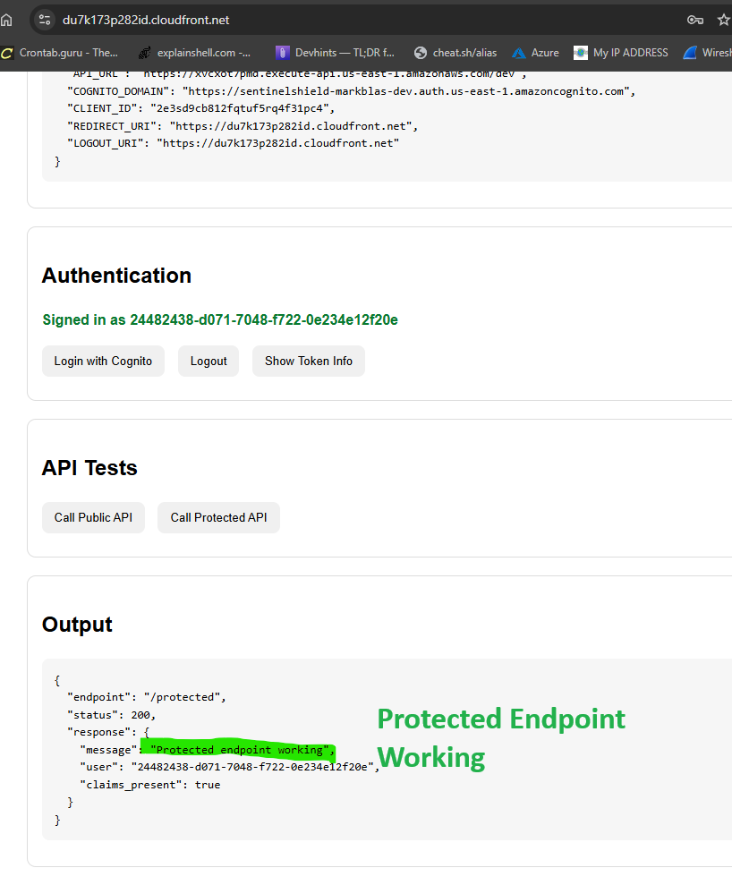
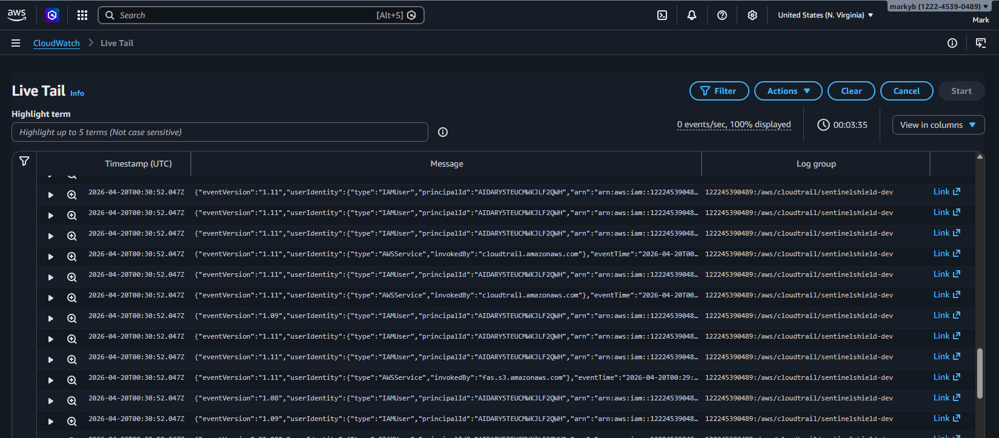

# SentinelShield — AWS Cloud Security & DevSecOps Project

## Overview

SentinelShield is a cloud security project designed to simulate a real-world AWS environment with secure architecture and integrated DevSecOps practices.

The project demonstrates how to build, secure, and validate a cloud application using infrastructure as code and automated security checks.

---

## Architecture

This environment includes:

* CloudFront delivering content from a private S3 bucket (no public access)
* AWS WAF protecting the application from common web attacks
* Amazon Cognito for authentication and JWT-based access control
* API Gateway and Lambda for backend services
* Centralized logging and monitoring services

---

## Security Implementation

* Private S3 with CloudFront Origin Access Control
* HTTPS enforced for all traffic
* JWT authentication using Cognito
* AWS WAF filtering malicious traffic
* KMS encryption across services
* CloudTrail, CloudWatch, and Config for auditing and monitoring
* GuardDuty and Security Hub for threat detection

---

## DevSecOps Pipeline

A GitHub Actions pipeline automates:

* Terraform validation
* Infrastructure security scanning using tfsec
* Misconfiguration scanning using Trivy
* Deployment planning

---

## API Security

* Public endpoint accessible without authentication
* Protected endpoint requires a valid JWT token from Cognito
* Lambda processes authenticated requests securely

---

## Monitoring & Logging

* CloudTrail tracks account activity
* CloudWatch logs capture application and network events
* VPC Flow Logs monitor network traffic
* Security Hub aggregates security findings

---

## Key Skills Demonstrated

* AWS Cloud Security Architecture
* Infrastructure as Code (Terraform)
* Identity and Access Management (IAM, Cognito)
* DevSecOps pipeline implementation
* API security and authentication
* Logging and threat detection

---

## What I Learned

* How to design secure cloud architectures using AWS services
* How to integrate security into CI/CD pipelines
* How to troubleshoot real-world issues such as access control and authentication flows
* How to balance security best practices with service constraints

---

## Future Improvements

* Replace static credentials with OIDC-based authentication in CI/CD
* Add automated remediation for security findings
* Expand to multi-account AWS architecture
* Build a dashboard for security visibility

---
